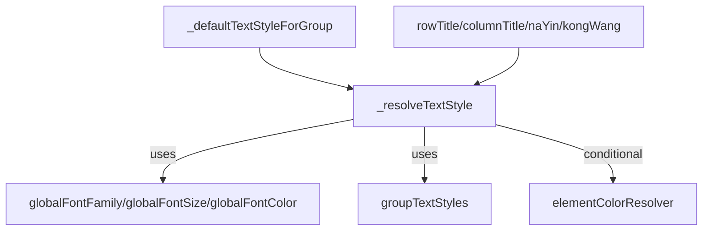
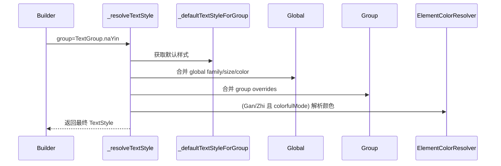

# DESIGN · 样式集中化迁移（EditableFourZhuCardV3）

## 1. 整体架构图
```mermaid
graph LR
  TG[TextGroup] --> DS[_defaultTextStyleForGroup]
  DS --> RS[_resolveTextStyle (base)]
  RS --> P1[Apply params: fontSize/weight/color]
  P1 --> G[Apply Global: fontFamily/fontSize/(fontColor*)]
  G --> C{colorfulMode?}
  C -- yes --> S1[Suppress Global Color for Gan/Zhi]
  C -- no --> S0[Color allowed]
  S1 --> GR[Apply Group Overrides]
  S0 --> GR
  GR --> F1[Shadows/Color merge]
  F1 --> NZ{is Gan/Zhi && !colorfulMode && color==null}
  NZ -- yes --> BK[Fill black87]
  NZ -- no --> OUT[TextStyle]
  BK --> OUT
```

## 2. 分层设计与核心组件
- Default Resolver：`_defaultTextStyleForGroup(TextGroup)`，提供组默认值。
- Style Resolver：`_resolveTextStyle(...)`，合并入参、全局、分组与 Gan/Zhi 规则。
- ElementColorResolver：彩色模式下的 Gan/Zhi 颜色来源（不在本次改动范围内）。
- GroupTextStyles：分组覆盖来源，允许 fontFamily/fontSize/fontWeight/shadows/color 的差异化设置。

## 3. 模块依赖关系图


## 4. 接口契约定义
- `_defaultTextStyleForGroup(TextGroup group) -> TextStyle`
  - 输入：TextGroup
  - 输出：组的默认 TextStyle（不包含动态解析逻辑）
  - 异常：无（默认返回空样式用于安全降级）
- `_resolveTextStyle({ double? fontSize, FontWeight? weight, Color? color, TextGroup? group }) -> TextStyle`
  - 输入：可选入参与组信息
  - 输出：合并后的 TextStyle
  - 规则：
    1) 以组默认为基准；
    2) 按入参 → 全局 → 分组顺序合并；
    3) Gan/Zhi 在 colorfulMode 下抑制全局颜色；
    4) Gan/Zhi 在非彩色模式下若未设置颜色则补黑。

## 5. 数据流向图


## 6. 异常处理策略
- 当 group 未提供或默认值为空时，返回空样式并仅按覆写合并。
- 彩色模式下的阴影 sentinel 颜色解析保持不变（沿用 impl 中现有逻辑）。
- 不抛异常；采用安全降级策略避免 UI 抖动。