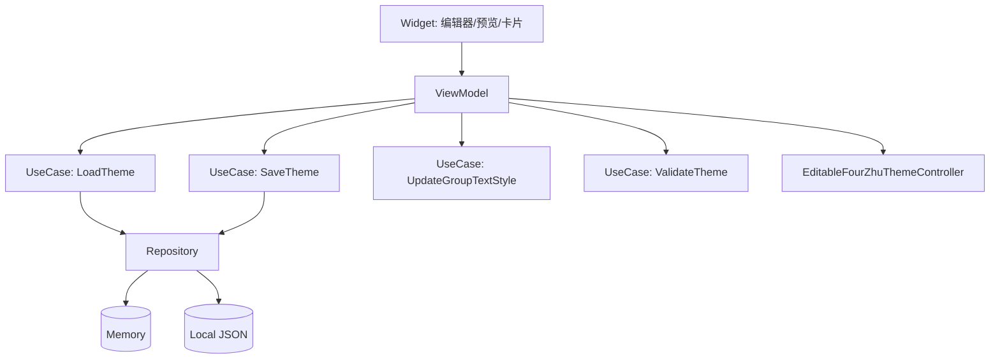

EditableFourZhu 自定义样式读写：MVVM + UseCase + Repository 接口与集成说明

更新时间：2025-11-07
目的：在不立即实现代码的前提下，明确后续可直接落地的接口层设计、数据流与集成点，保障“开箱即用”接入体验。

一、总体设计
- 分层：Repository（数据访问）、UseCase（业务用例）、ViewModel（展示与交互）、Widget（编辑器与预览）、ThemeController（解析渲染）。
- 目标：支持主题的读取/保存/订阅、分组字体更新、校验与多配置档（Profile）管理。

二、架构关系图（Mermaid）

三、接口契约（描述版）
1) Repository 接口（common/lib/domain/repositories/editable_four_zhu_style_repository.dart）
- fetchTheme({String? profileId}) → Future<EditableFourZhuCardTheme>
  - 功能：读取指定配置档主题；无则返回默认主题。
- saveTheme(EditableFourZhuCardTheme theme, {String? profileId}) → Future<void>
  - 功能：校验通过后持久化主题到配置档。
- watchTheme({String? profileId}) → Stream<EditableFourZhuCardTheme>
  - 功能：订阅主题变更，用于多处 UI 同步更新。
- listProfiles() → Future<List<String>>
  - 功能：列出所有配置档 ID。
- deleteProfile(String profileId) → Future<void>
  - 功能：删除指定配置档。

2) Datasource 默认实现（描述）
- MemoryEditableFourZhuStyleRepository（common/lib/datasource/style/memory_style_repository.dart）
  - 内存 Map<String, EditableFourZhuCardTheme> 存储；watch 使用 StreamController 广播；适用于测试与无 IO 场景。
- LocalJsonEditableFourZhuStyleRepository（common/lib/datasource/style/local_json_style_repository.dart）
  - 平台可写目录保存 JSON 文件（profileId.json）；字段含 schemaVersion；读写时进行基本校验与兼容处理；Web 可选 localStorage/IndexedDB 或内存方案。

3) UseCase（common/lib/domain/usecases/style/）
- LoadThemeUseCase(repository) → call({String? profileId}) → Future<EditableFourZhuCardTheme>
- SaveThemeUseCase(repository) → call(EditableFourZhuCardTheme theme, {String? profileId}) → Future<void>
  - 保存前执行 theme.validate()；有错误则抛出 StateError。
- UpdateGroupTextStyleUseCase → call({required EditableFourZhuCardTheme current, required TextGroup group, required TextStyle style}) → EditableFourZhuCardTheme
  - 根据分组更新不可变主题对象（返回新对象）。
- ValidateThemeUseCase → call(EditableFourZhuCardTheme theme) → List<String>
  - 返回问题列表，空表示通过。

4) ViewModel（common/lib/viewmodels/editable_four_zhu_theme_viewmodel.dart）
- 字段：
  - EditableFourZhuCardTheme? theme
  - String? currentProfileId
  - ChangeNotifier/ValueNotifier 用于 UI 订阅
- 方法：
  - loadTheme({String? profileId}) → Future<void>
  - updateGroupStyle(TextGroup group, TextStyle style) → void
  - saveCurrentTheme() → Future<void>
  - validateCurrentTheme() → List<String>
  - 订阅仓库 watchTheme：可选，用于多处同步。

四、数据模型与 JSON Schema（示例草案）
- 文件名：profiles/<profileId>.json（或应用可写目录根下）
- 字段：
  - schemaVersion: 1
  - globalFontFamily: String?（可空）
  - fontFamilyFallback: List<String>
  - groupTextStyles: Map<TextGroup, TextStyleSerializable>（TextStyle 可序列化字段）
  - cardDecoration: { padding, margin, borderWidth, cornerRadius, elevation, bgColor }
  - perPillarMargin: Map<PillarType, EdgeInsetsSerializable>
  - colorfulMode: bool
  - perCharColors: { tianGan: Map<TianGan, Color>, diZhi: Map<DiZhi, Color> }
    · 序列化约定：JSON 持久化时键写入为枚举名字符串（如 "JIA"/"ZI"），读取时反序列化为 TianGan/DiZhi 类型；运行时始终以类型安全 Map<TianGan, Color>/Map<DiZhi, Color> 进行访问。
- 约束：
  - 非负：padding/margin/borderWidth/cornerRadius/elevation 不得为负。
  - 枚举：TextGroup/PillarType/TianGan/DiZhi 使用字符串枚举值进行持久化；代码中使用对应类型枚举进行访问，保持类型安全。
  - 兼容：未知字段保留但忽略；未来版本通过 schemaVersion 做迁移。

五、集成与使用指引（描述）
- Demo 页面集成：
  1) 构造 Repository（Memory 或 Local JSON）。
  2) 构造 UseCase（Load/Save/Update/Validate）。
  3) 构造 ViewModel，调用 loadTheme()。
  4) 编辑器面板 onChanged → viewModel.updateGroupStyle(...)
  5) “保存”按钮 → viewModel.saveCurrentTheme()
  6) 卡片组件订阅 ViewModel 的 theme 并通过 ThemeController 解析渲染。
- Navigator：保持指向 EditableFourZhuCardDemoPage；Demo 中展示“配置档切换、保存、还原默认”。

六、错误处理与校验
- 保存前：ValidateThemeUseCase 检查；存在问题时阻止保存并返回列表。
- 订阅：watchTheme 异常通过 onError 通道上报；UI 可提示重试或回退默认。
- IO：Local JSON 打开失败时回退到内存默认；下次成功保存再落盘。

七、测试计划（描述）
- Repository：
  - Memory：读/写/订阅流、配置档切换、删除。
  - Local JSON：读/写/schemaVersion 兼容；异常容错与默认回退。
- UseCase：
  - Validate：正确识别非负/枚举错误。
  - UpdateGroup：不可变更新与多组联动不冲突。
- ViewModel：
  - 加载通知、更新通知、保存后持久化状态。
- Widget：
  - 编辑器回调联动 ViewModel；卡片渲染联动 ThemeController（基本黄金测试）。

八、验收标准（后续实现验收）
- 接口：上述方法在 Memory 与 Local JSON 两套仓库中均可用。
- 集成：Demo 页面提供默认接入示例（加载/更新/保存/切换）；无崩溃。
- 质量：
  - 所有函数具备函数级注释（功能/参数/返回值/异常）。
  - 单元/Widget/Golden 测试通过，关键路径覆盖到位。
- 文档：说明文档新增“接口落地与用法”章节与路径指引。

九、时间线建议（可与优化方案联动）
- 2025-11-12：完成接口与骨架实现（Memory/Local JSON + UseCase + ViewModel）
- 2025-11-13：Demo 接入与单元/Widget/Golden 测试
- 2025-11-14：文档与示例完善，形成“开箱即用”交付包

十、风险与回滚
- 风险：
  - 本地 JSON 在 Web 环境的可写性差异（可先走内存或 localStorage）。
  - 主题字段未来扩展造成兼容压力（通过 schemaVersion 迁移规避）。
- 回滚：
  - 保留 Memory 仓库作为兜底；Local JSON 出错时切换到内存并提示用户。

附录：命名与路径建议
- repositories：common/lib/domain/repositories/editable_four_zhu_style_repository.dart
- datasource：common/lib/datasource/style/{memory_style_repository.dart, local_json_style_repository.dart}
- usecases：common/lib/domain/usecases/style/
- viewmodel：common/lib/viewmodels/editable_four_zhu_theme_viewmodel.dart
- 文档：common/docs/feature/editable_eight_char/EditableFourZhuCardV3_refactor/MVVM_UseCase_Repository_Interface.md