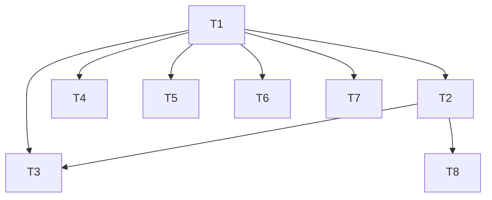

# TASK · 样式集中化迁移（EditableFourZhuCardV3）

## 原子任务拆分

### T1 · 集中默认入口与四个 builder 去硬编码（已完成）
- 输入契约：
  - 源文件 `editable_fourzhu_card_impl.dart`
  - 现有 `_resolveTextStyle` 与 `groupTextStyles/globalFont*` 约束
- 输出契约：
  - 新增 `_defaultTextStyleForGroup(TextGroup)`；
  - `_rowTitleText/_columnTitleText/_naYinText/_kongWangText` 去硬编码，仅传 `group`；
  - `_resolveTextStyle` 以组默认为基准进行合并，Gan/Zhi 非彩色补黑。
- 实现约束：
  - 保持视觉不变；保留彩色模式与分组覆盖逻辑；函数级注释完整。
- 依赖关系：无（起点任务）。
- 验收：
  - 运行 `flutter test common/test/widgets/editable_fourzhu_card_v3_pure_drag_test.dart common/test/widgets/drag_controller_throttle_test.dart` → 通过。
  - 文档更新到位（说明文档与 TODO 清单）。

### T2 · 扩展默认样式到更多行类型（旬首/十神/藏干系列）
- 输入契约：
  - RowType 枚举与现有显示逻辑；编辑器与主题控制器当前行为。
- 输出契约：
  - `_defaultTextStyleForGroup` 增加对应 TextGroup 的默认值（字号/粗细/颜色建议）。
- 实现约束：
  - 默认值采用保守风格（14sp / w400 / 黑色系），避免视觉突兀；后续可调整。
- 依赖关系：T1 完成。
- 验收：
  - 编译通过；说明文档记载默认值来源与理由。

### T3 · Widget 测试：默认与覆盖优先级（NaYin/KongWang/Gan/Zhi）
- 输入契约：
  - 组件构建参数：`globalFont*` 与 `groupTextStyles`；colorfulMode 开/关场景。
- 输出契约：
  - 测试用例验证：
    1) 无覆盖时默认样式正确（字号/粗细/颜色）；
    2) Global/Group 覆盖优先级正确；
    3) Gan/Zhi 彩色模式下全局色抑制，非彩色模式默认黑色。
- 实现约束：
  - 使用 `find.byKey` 或精确定位，避免坐标不稳定。
- 依赖关系：T1/T2 完成。
- 验收：测试全部通过。

### T4 · GroupTextStyleEditorPanel 联动与优先级验证
- 输入契约：
  - `group_text_style_editor_panel.dart` 与 `groupTextStyles` 更新管道。
- 输出契约：
  - 联动验证：编辑器更新能正确覆盖集中默认；Gan/Zhi 彩色模式下颜色覆盖策略符合预期（分组可覆盖、全局被抑制）。
- 实现约束：
  - 不改动编辑器交互，只验证与默认入口的一致性。
- 依赖关系：T1 完成。
- 验收：Demo/测试验证无回归，说明文档记录验证结果。

### T5 · 迁移指引文档（开发规范）
- 输入契约：
  - 说明文档现有内容与团队开发规范。
- 输出契约：
  - `docs/feature/.../MIGRATION_GUIDE_样式集中化.md`：接入新行样式的统一流程（默认值来源、覆盖优先级、颜色来源与 dark/light 建议）。
- 实现约束：
  - 简洁可执行；避免与现有文档冲突。
- 依赖关系：T1 完成。
- 验收：文档审阅通过并进入使用。

### T6 · 通用文本构建器（可选）
- 输入契约：
  - 常见字符串构造点。
- 输出契约：
  - `_textForGroup(String s, TextGroup g)` 或等价封装，统一使用集中入口。
- 实现约束：
  - 渐进式替换，避免一次性大改动。
- 依赖关系：T1 完成。
- 验收：编译与定向测试通过；说明文档记录替换范围。

### T7 · 样式解析缓存（可选）
- 输入契约：
  - 高频路径下的重复样式合并。
- 输出契约：
  - 轻量缓存策略（如基于 group 与 global/group 覆写的快照），避免过度优化。
- 实现约束：
  - 优先可读性；避免跨帧状态共享导致的样式滞留。
- 依赖关系：T1 完成。
- 验收：基准采样显示重建次数或合并次数有所下降（调试输出）。

### T8 · Golden 回归验证（必要时）
- 输入契约：
  - 现有 Golden 基线与预览尺寸。
- 输出契约：
  - 运行 Golden 测试确认无视觉回归；如有变化需逐项说明原因并评估是否符合预期。
- 实现约束：
  - 仅在检测到视觉变化后启动；否则以定向测试为主。
- 依赖关系：T1/T2 完成。
- 验收：Golden 通过或变更说明获批准。

## 任务依赖图
