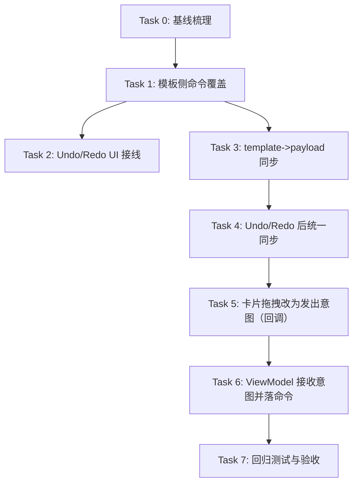

# Undo 功能 - 可执行 Tasks & Todo List（common）

## 背景与目标
本任务为四柱卡片编辑器增加「Undo/Redo（撤销/重做）」能力，要求：
- 所有实现代码与测试均落在 `common/` 内
- Undo/Redo 覆盖：模板侧的布局/样式编辑（第一阶段），以及卡片内拖拽导致的行/列变更（第二阶段）
- 避免出现 LayoutTemplate 与 CardPayload 的状态分裂（撤销后 UI 与卡片预览必须一致）

## 现状摘要（用于对齐）
- `FourZhuEditorViewModel` 已具备 `CommandHistory` 与 `undoLastChange/redoLastChange`，但只有部分操作使用 command；大量更新仍走 `_applyCurrentTemplate` 直改，无法被 Undo 捕获。
- `EditableFourZhuCardV3` 内部对 `cardPayloadNotifier` 直接写入（例如删除/插入行列），绕开 ViewModel，无法纳入 Undo。
- `EditorCommand` 当前绑定 `LayoutTemplate`（非泛型），Undo 栈只对模板状态生效。

## 范围边界
- 仅实现编辑器 Undo/Redo；不做跨页面/跨进程的 Undo 持久化。
- 不引入新的第三方库。
- 以 `LayoutTemplate` 作为唯一“可撤销真相”；`CardPayload` 为运行时投影（由 ViewModel 同步）。

---

## 任务依赖图

---

## Tasks（可执行拆分）

### Task 0：基线梳理（不改行为）
**目标**：明确哪些编辑路径需要纳入命令历史，输出一份“缺口清单”以对照实现完成度。  
**输入契约**：当前 common 代码。  
**输出契约**：
- 缺口清单（写在本文件的“完成记录”里）：哪些方法直改 template、哪些地方直改 payload。  
**验收标准**：
- 列出至少：`reorderRowsByTypes/updateRowOrder/updateRowTitleVisibility` 等 template 直改点；以及 `EditableFourZhuCardV3` 中删除/插入行列的 payload 直改点。

---

### Task 1：模板侧命令覆盖（第一阶段核心）
**目标**：将所有“影响模板最终保存结果”的编辑操作统一纳入 `CommandHistory`。  
**输入契约**：
- `common/lib/viewmodels/four_zhu_editor_view_model.dart`
- `common/lib/commands/editor_command.dart`
- `common/lib/commands/template_commands.dart`
**输出契约**：
- 在 `template_commands.dart` 增加/补齐命令类（每个命令具备：功能描述、参数、返回用途的函数级注释）。
- ViewModel 中相关方法改为 `_executeCommand(...)` 路径。
**建议命令清单（按优先级）**：
1. `ReorderRowConfigsCommand`（保存 old/new rowConfigs，execute/undo 直接替换）
2. `UpdateRowTitleVisibilityCommand`
3. `UpdateDividerTypeCommand / UpdateDividerColorCommand / UpdateDividerThicknessCommand`（将卡片样式编辑也纳入 undo）
4.（如存在）对分组/柱顺序的补齐命令（确认现有是否全覆盖）
**验收标准**：
- 任意一个模板侧编辑动作发生后，`viewModel.canUndo == true`
- `undoLastChange/redoLastChange` 可对上述变更逐步回滚

---

### Task 2：Undo/Redo UI 接线（第一阶段可见交付）
**目标**：编辑页面提供「撤销一步 / 重做一步」按钮，并与状态联动。  
**输入契约**：
- `common/lib/pages/four_zhu_edit_page.dart`
- `FourZhuEditorViewModel.canUndo/canRedo/undoLastChange/redoLastChange`
**输出契约**：
- UI 增加 Undo/Redo 按钮（保留现有“撤销更改=revertChanges”，但命名区分清晰）
- disabled 状态正确（canUndo/canRedo 控制）
**验收标准**：
- 做一次操作后 Undo 可点；Undo 后 Redo 可点；Redo 后可再次 Undo
- 不引入崩溃与明显布局问题

---

### Task 3：template → cardPayload 同步（解决状态分裂）
**目标**：新增统一同步函数，让卡片预览始终反映 `LayoutTemplate` 的可撤销状态。  
**输入契约**：
- `FourZhuEditorViewModel` 中 `cardPayloadNotifier`
- `LayoutTemplate.rowConfigs`、`ChartGroup.pillarOrder`
- `CardPayload` 的 `rowOrderUuid/pillarOrderUuid/rowMap/pillarMap`
**输出契约**：
- 新增 `_syncCardPayloadFromTemplate(LayoutTemplate template)`（私有）
- 使用稳定映射保持 UUID 不抖动（例如 RowType→uuid、PillarType→uuid 的内部缓存）
**实现约束**：
- 不改变 rowMap/pillarMap 的 payload 内容（除非为了补齐缺失项必须生成新 uuid）
- 不允许同步后丢失现有行/柱
**验收标准**：
- 切换模板、Undo/Redo 后：卡片行顺序/柱顺序与模板配置一致
- 反复 Undo/Redo 多次不产生重复/丢失 uuid

---

### Task 4：Undo/Redo 后统一同步（模板 + 运行时主题 + payload）
**目标**：确保以下入口都会触发必要的同步逻辑：
- `_executeCommand`
- `undoLastChange`
- `redoLastChange`
- `selectTemplate`
- `revertChanges`
**输入契约**：
- ViewModel 现有 `_syncRuntimeThemeFromCardStyle`
- Task 3 的 `_syncCardPayloadFromTemplate`
**输出契约**：
- 上述入口在模板更新后调用同步函数
**验收标准**：
- 无论通过何入口改变 template，卡片预览与主题相关 notifier 均同步更新

---

### Task 5：卡片拖拽从“直写 payload”改为“发出意图”（第二阶段核心）
**目标**：`EditableFourZhuCardV3` 内部不再直接修改 `cardPayloadNotifier.value` 来完成插入/删除/重排，而是通过回调把“用户意图”交给外部（ViewModel）。  
**输入契约**：
- `common/lib/features/four_zhu_card/widgets/editable_fourzhu_card/editable_fourzhu_card_impl.dart`
- `EditorWorkspace` 中对 `EditableFourZhuCardV3` 的使用
**输出契约**：
- 为 V3 增加回调（示例，最终以最小可用为准）：
  - `onRowReorderRequested(oldIndex, newIndex)`
  - `onRowDeleteRequested(absIndex)`
  - `onRowInsertRequested(insertIndex, RowPayload payload)`（或更抽象的 type/label）
  - 列/柱同理：`onPillarReorderRequested/onPillarDeleteRequested/...`
- 将 `_deleteRow/_deleteColumn/_insertExternalRow/_setRows/_setPillars` 的“数据写入”替换为触发回调
**验收标准**：
- 拖拽仍能触发同等 UI 行为（由外部完成状态更新后反馈到 notifier）
- 卡片内部不再出现对 `widget.cardPayloadNotifier.value = ...` 的写入（除非保留为 fallback，需明确开关策略）

---

### Task 6：ViewModel 接收卡片意图并落命令（第二阶段闭环）
**目标**：将卡片拖拽/插入/删除等操作映射为 `LayoutTemplate` 的命令，从而可 Undo/Redo。  
**输入契约**：
- Task 5 的回调
- Task 1 的模板命令框架
- Task 3 的同步函数
**输出契约**：
- 在 `FourZhuEditorViewModel` 增加公开方法（供 UI 调用）：
  - `requestRowReorder(oldIndex,newIndex)` / `requestPillarReorder(...)` 等
- 内部执行 `_executeCommand(...)` + 同步 payload
**验收标准**：
- 卡片上拖拽/删除/插入后可逐步 Undo/Redo
- Undo/Redo 后卡片与侧边栏/列表（若相关）状态一致

---

### Task 7：回归测试与验收
**目标**：为关键同步与 Undo 行为提供自动化回归，避免后续改动破坏。  
**输入契约**：现有测试框架（需先确认 common 是否已有 test 目录与 flutter_test 配置）。  
**输出契约**：
- 对 `CommandHistory`/命令合并策略（如有）单测
- 对 `FourZhuEditorViewModel` 的 Undo/Redo 与同步行为单测（至少覆盖：行重排、样式变更一项、Undo/Redo 后 payload 顺序一致）
**验收标准**：
- 测试可运行且稳定
- 覆盖核心回归点（状态分裂、uuid 抖动）

---

## Todo List（按执行顺序）
- [ ] Task 0：基线梳理与缺口清单（记录到“完成记录”）
- [ ] Task 1：补齐模板侧命令，并把直改入口改为 `_executeCommand`
- [ ] Task 2：页面增加 Undo/Redo 按钮并接线
- [ ] Task 3：实现 `_syncCardPayloadFromTemplate`（稳定 uuid 映射）
- [ ] Task 4：在 `_executeCommand/undo/redo/select/revert` 等入口统一调用同步
- [ ] Task 7（先行）：为 Task 1/3/4 的核心行为补基础单测（若测试环境已具备）
- [ ] Task 5：V3 卡片增加回调并移除内部直写 payload
- [ ] Task 6：ViewModel 接收卡片意图并落命令，打通 Undo/Redo
- [ ] Task 7：补齐第二阶段回归测试与验收

---

## 验收清单（最终交付必须满足）
- [ ] 模板侧编辑：行顺序/可见性/卡片样式至少 1 类操作可 Undo/Redo
- [ ] Undo/Redo 后：`LayoutTemplate` 与 `cardPayloadNotifier` 不分裂（预览一致）
- [ ] 卡片侧拖拽：至少覆盖“行重排”可 Undo/Redo（第二阶段完成后覆盖删除/插入）
- [ ] 无明显性能退化（拖拽过程中不引入高频 rebuild 或重算抖动）

---

## 补充考虑点（原子化清单）
- [ ] 定义单一真相：`LayoutTemplate` 为唯一可撤销状态，`CardPayload` 仅为运行时投影
- [ ] 彻底梳理并封堵“绕过 ViewModel 直写 `cardPayloadNotifier`”的路径（必要时仅保留可控 fallback）
- [ ] 设计并实现稳定 UUID 映射（`RowType -> rowUuid`、`PillarType -> pillarUuid`），避免同步后 uuid 抖动
- [ ] 明确双向编辑冲突策略：模板侧顺序编辑与 payload 侧顺序编辑的优先级与同步方向
- [ ] 定义不可删除/不可重排约束：标题行/标题列、分隔符、锁定分组（`ChartGroup.locked`）等
- [ ] 定义插入/删除语义：新增 RowType 配置 vs 仅预览临时行，确保保存后与预览一致
- [ ] 明确分组与柱顺序范围：组内重排还是全局重排，多分组场景的 Undo 还原规则
- [ ] 设定 Undo 栈合并策略：拖拽移动只在 drop 时入栈，禁止 onMove 高频入栈
- [ ] 设定 Undo 栈清空策略：切换模板、加载模板、revert、save 后是否清空 undo/redo，并保持一致
- [ ] 评估历史大小与内存：命令保存 old/new 列表的成本与 `maxHistorySize` 的取值
- [ ] 增加快捷键支持：macOS `Cmd+Z` / `Cmd+Shift+Z`，并避免抢占 `TextField` 的系统撤销
- [ ] 提供操作可解释性：按钮 tooltip 或使用 `EditorCommand.description` 展示“撤销了什么”
- [ ] 保证事务性：一次用户动作的 template/payload/theme 同步需原子完成，避免 UI 中间态闪烁
- [ ] 定义同步后的缓存失效策略：payload 变化后 metricsSnapshot、rowSpansCache 等需要正确重算
- [ ] 约束 notify 时序：避免监听者收到半更新状态（尤其是 Undo/Redo 与同步函数组合）
- [ ] 补齐边界测试：undo 到栈空、redo 到栈空、undo 后新操作清空 redo、跨模板切换不污染历史
- [ ] 补齐一致性断言：每次操作/Undo/Redo 后断言 template 与 payload 顺序映射一致（防状态分裂）
- [ ] 覆盖索引/override 回归：插入/删除导致的行高覆盖（如 `_rowHeightOverrides`）与索引迁移正确

---

## 完成记录（实施时逐条追加）
- （待填写）