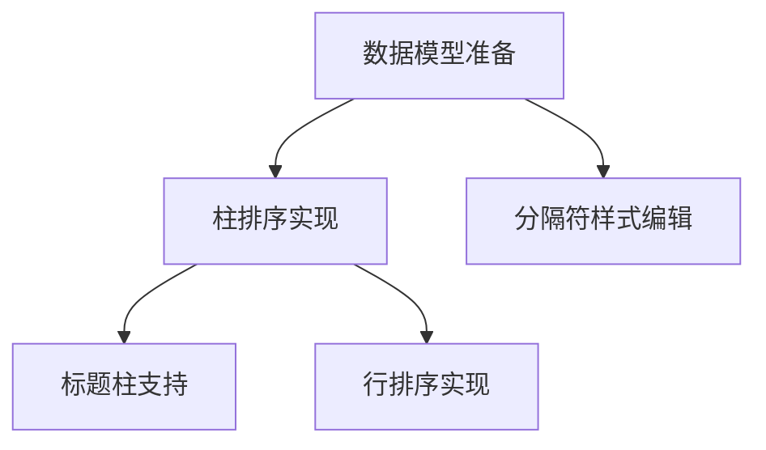

# TASK_sidebar_enhancement

## 1. 任务拆分

### 任务 1: 文档与数据模型准备 (Completed)
- [x] 创建 `ALIGNMENT_sidebar_enhancement.md`
- [x] 确认 `ChartGroup` 和 `CardPayload` 中关于柱排序的数据结构

### 任务 2: 柱排序功能实现 (Completed)
- [x] `FourZhuEditorViewModel`: 新增 `reorderPillarsInGroup` 方法，支持持久化存储排序。
- [x] `FourZhuCardDemoViewModel`: 新增 `updatePillarOrderFromTypes` 方法，支持 Card 实时预览。
- [x] `SidebarPillarEditorSection`: 改造为 `ReorderableListView`，集成拖拽排序 UI。
- [x] 验证拖拽排序在 Sidebar 和 Card 之间的同步。

### 任务 3: 标题柱 (Row Title Column) 支持 (Completed)
- [x] **需求**: Sidebar 柱配置列表中缺少“标题柱”，需补充显示并支持排序。
- [x] **修改 `SidebarPillarEditorSection.dart`**:
    - [x] 移除或调整对 `PillarType.rowTitleColumn` 的过滤逻辑。
    - [x] 确保“标题柱”在列表中有正确的 Label (如“标题列”)。
    - [x] 确保拖拽“标题柱”能正确触发 `reorderPillarsInGroup` 和 `updatePillarOrderFromTypes`。
- [x] **验证**:
    - [x] 确认标题柱出现在 Sidebar 列表中。
    - [x] 确认标题柱可以拖拽至其他位置（如从最左侧拖到最右侧）。
    - [x] 确认 Card 预览中标题柱位置随之改变。

### 任务 4: 行排序功能实现 (Completed)
- [x] 确认 Sidebar 中行配置列表 (`RowStyleEditorPanel` 或类似组件) 是否已支持拖拽。
- [x] 如未支持，参照柱排序模式实现 `ReorderableListView`。
- [x] 实现 ViewModel 层面的行排序逻辑 (`reorderRowsByTypes`)。
- [x] 实现 DemoViewModel 层面的行排序同步 (`updateRowOrderFromTypes`)。

### 任务 5: 分隔符样式编辑 (Completed)
- [x] **需求**:
    - Sidebar 新增 Slider 控制 Pillar Separator Width。
    - Sidebar 新增 Slider 控制 Row Separator Height。
- [x] **修改 `FourZhuPillarStyleEditor.dart`**:
    - [x] 增加 `separatorWidth` 的 Slider（仅当 `pillarType == separator` 时显示）。
- [x] **修改 `RowStyleEditorPanel.dart`**:
    - [x] 增加 `separatorHeight` 的 Slider（仅当 `rowType == separator` 时显示）。
- [x] **验证**:
    - [x] 调节 Slider，预览中的分隔符宽/高实时变化。

## 2. 依赖关系图

