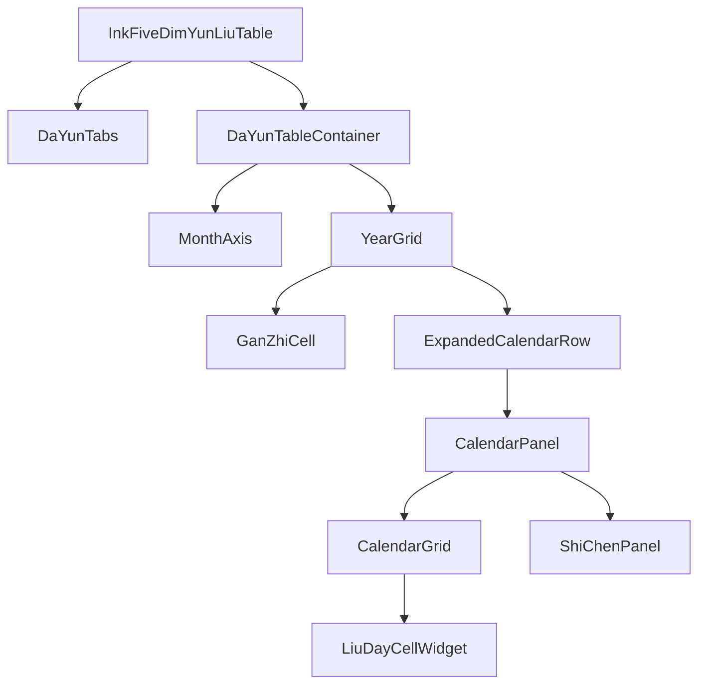

# DESIGN - 组件分层架构

## 整体架构

## 核心接口定义
- `LiuDayCellWidget`: 
  - 输入: `date`, `isToday`, `isSelected`, `ganText`, `zhiText`, `tenGodName`, `hidden`, `jieQi`, `zodiac`, `lunarText`
  - 事件: `onTap`
- `ShiChenPanel`:
  - 输入: `selectedDate`, `strategy`
  - 事件: `onClose`, `onStrategyChanged`

## 异常处理
- 对于高度溢出，`LiuDayCellWidget` 将内部 `Column` 包装在 `SingleChildScrollView` 或通过 `LayoutBuilder` 动态调整 `s` 缩放系数。