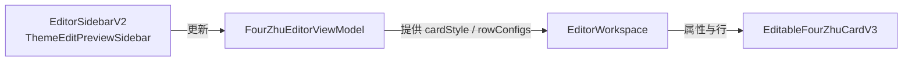

# 阶段2：Architect（架构与设计）

## 整体架构图

## 分层与核心组件
- UI：`FourZhuEditPage` 装配，Sidebar 与 Workspace 并排；
- 状态：`FourZhuEditorViewModel` 管理模板与样式；
- 视图：`EditorWorkspace` 订阅 ViewModel，驱动 `EditableFourZhuCardV3`。

## 模块依赖
- `EditorWorkspace` 依赖 ViewModel 的 `cardStyle` 与 `rowConfigs`。
- `EditableFourZhuCardV3` 接收字体与行数据以渲染。

## 接口契约
- `cardStyle.globalFontFamily/globalFontSize/globalFontColorHex` → V3 字体属性。
- `rowConfigs`（可见性/标题可见性）→ 映射为 `RowInfoPayload` 列表。

## 数据流向
- Sidebar 编辑 → ViewModel 更新 → Workspace 读取 → 通知 V3 组件更新。

## 异常处理策略
- 若 `currentTemplate` 为空，Workspace 使用默认行与默认字体；
- 未识别的行类型暂不映射，保持页面稳定性。