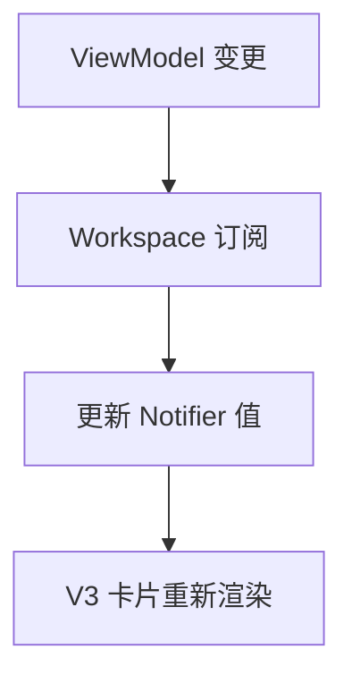

# 阶段3：Atomize（任务原子化）

## 任务1：绑定 Workspace 到 ViewModel 并映射到 V3
- 输入契约：`FourZhuEditorViewModel.cardStyle / rowConfigs` 可用；
- 输出契约：`EditorWorkspace` 将字体与行映射给 `EditableFourZhuCardV3`；
- 实现约束：Flutter/Provider，最小改动，不影响现有页面结构；
- 依赖关系：无并行依赖；
- 验收标准：侧栏编辑后 V3 卡片的字体与行显示即时更新。

