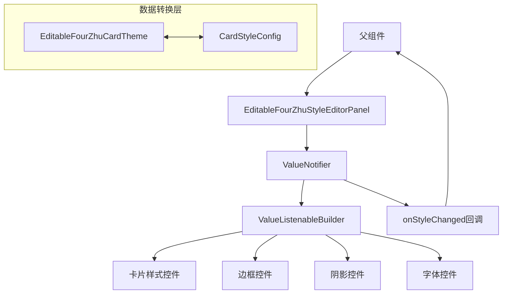
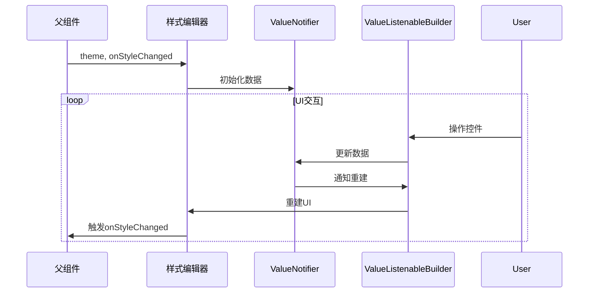

# DESIGN_重构四柱卡片样式编辑器

## 整体架构图


## 分层设计
### 1. 数据层 (Data Layer)
- **核心数据结构**: `ValueNotifier<CardStyleConfig>`
- **数据转换**: `EditableFourZhuCardTheme` ↔ `CardStyleConfig` 转换方法
- **状态管理**: 单一数据源，避免状态分散

### 2. 业务逻辑层 (Business Logic Layer)
- **状态更新**: 通过 `ValueNotifier.value` 更新数据
- **回调处理**: 监听数据变化并触发 `onStyleChanged`
- **数据同步**: 确保UI与数据状态一致

### 3. 表现层 (Presentation Layer)
- **细粒度重建**: `ValueListenableBuilder` 按需重建
- **控件分组**: 按功能模块分离UI控件
- **响应式设计**: 数据驱动UI更新

## 核心组件
### ValueNotifier 状态管理
```dart
final ValueNotifier<CardStyleConfig> _styleConfig = ValueNotifier(CardStyleConfig());
```

### ValueListenableBuilder 模式
```dart
ValueListenableBuilder<CardStyleConfig>(
  valueListenable: _styleConfig,
  builder: (context, config, child) {
    return YourWidget(config: config);
  },
)
```

## 接口契约定义
### 输入接口
- `theme`: EditableFourZhuCardTheme - 初始样式配置
- `onStyleChanged`: Function(EditableFourZhuCardTheme) - 样式变化回调

### 输出接口
- 通过 `onStyleChanged` 返回更新后的 `EditableFourZhuCardTheme`

## 数据流向图


## 异常处理策略
1. **数据转换异常**: 提供默认值回退机制
2. **空值处理**: 所有字段提供合理的默认值
3. **回调异常**: 确保回调函数不为null
4. **内存管理**: 正确dispose ValueNotifier

## 技术约束
- 必须保持与现有 `EditableFourZhuCardTheme` 的兼容性
- 必须支持所有现有的样式配置选项
- 性能必须优于当前的 setState 实现