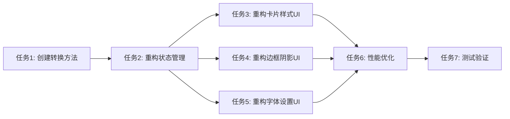

# TASK_重构四柱卡片样式编辑器

## 任务依赖图

## 原子任务列表

### 任务1: 创建数据转换方法
**输入契约**: 
- 现有 `EditableFourZhuCardTheme` 结构
- 现有 `CardStyleConfig` 数据类

**输出契约**: 
- `CardStyleConfig fromTheme(EditableFourZhuCardTheme theme)` 方法
- `EditableFourZhuCardTheme toTheme(CardStyleConfig config)` 方法
- 完整的字段映射验证

**验收标准**: 
- ✅ 所有样式字段正确映射
- ✅ 支持双向转换
- ✅ 提供合理的默认值处理

**预计耗时**: 1小时

### 任务2: 重构状态管理
**输入契约**: 
- 任务1完成的转换方法
- 现有的状态变量和控制器

**输出契约**: 
- `ValueNotifier<CardStyleConfig> _styleConfig` 主状态
- 更新 `initState`、`didUpdateWidget`、`dispose` 生命周期
- 替换所有 `setState` 调用为 `_styleConfig.value` 更新

**验收标准**: 
- ✅ 状态管理完全迁移到 ValueNotifier
- ✅ 生命周期方法正确实现
- ✅ 内存管理正确 (dispose)

**预计耗时**: 2小时

### 任务3: 重构卡片样式UI控件
**输入契约**: 
- 任务2完成的状态管理
- 现有的卡片样式UI代码 (内边距、圆角、背景色)

**输出契约**: 
- 使用 `ValueListenableBuilder` 包装卡片样式控件
- 实现细粒度的UI重建
- 保持现有的UI布局和功能

**验收标准**: 
- ✅ 卡片样式功能正常工作
- ✅ 实现细粒度重建
- ✅ UI布局保持不变

**预计耗时**: 2小时

### 任务4: 重构边框和阴影UI控件
**输入契约**: 
- 任务2完成的状态管理
- 现有的边框和阴影UI代码

**输出契约**: 
- 使用 `ValueListenableBuilder` 包装边框阴影控件
- 实现细粒度的UI重建
- 保持边框颜色、宽度、阴影等所有功能

**验收标准**: 
- ✅ 边框和阴影功能正常工作
- ✅ 实现细粒度重建
- ✅ 所有交互功能保持

**预计耗时**: 2小时

### 任务5: 重构字体设置UI控件
**输入契约**: 
- 任务2完成的状态管理
- 现有的字体设置UI代码

**输出契约**: 
- 使用 `ValueListenableBuilder` 包装字体控件
- 实现细粒度的UI重建
- 保持字体家族、字号等功能

**验收标准**: 
- ✅ 字体设置功能正常工作
- ✅ 实现细粒度重建
- ✅ 字体选择功能完整

**预计耗时**: 1.5小时

### 任务6: 性能优化
**输入契约**: 
- 所有UI重构完成
- 现有的性能基准

**输出契约**: 
- 优化重建范围，避免不必要的重建
- 确保内存使用合理
- 验证性能提升效果

**验收标准**: 
- ✅ 性能优于原 setState 实现
- ✅ 内存使用合理
- ✅ 无内存泄漏

**预计耗时**: 1小时

### 任务7: 测试验证
**输入契约**: 
- 所有重构任务完成
- 现有的测试用例

**输出契约**: 
- 功能完整性验证
- 性能测试报告
- 回归测试通过

**验收标准**: 
- ✅ 所有功能正常工作
- ✅ 性能提升验证
- ✅ 无回归问题

**预计耗时**: 1小时

## 总预计耗时: 10.5小时

## 实施约束
- **技术栈**: Flutter, ValueNotifier, ValueListenableBuilder
- **代码规范**: 遵循现有项目代码风格
- **测试要求**: 确保100%功能覆盖
- **兼容性**: 必须与现有父组件接口兼容

## 风险控制
1. **数据不一致风险**: 通过完整的字段映射验证来缓解
2. **性能风险**: 通过细粒度重建和性能测试来确保
3. **回归风险**: 通过全面的测试验证来预防

## 质量门控
- ✅ 代码审查通过
- ✅ 所有测试通过
- ✅ 性能指标达标
- ✅ 用户体验无退化